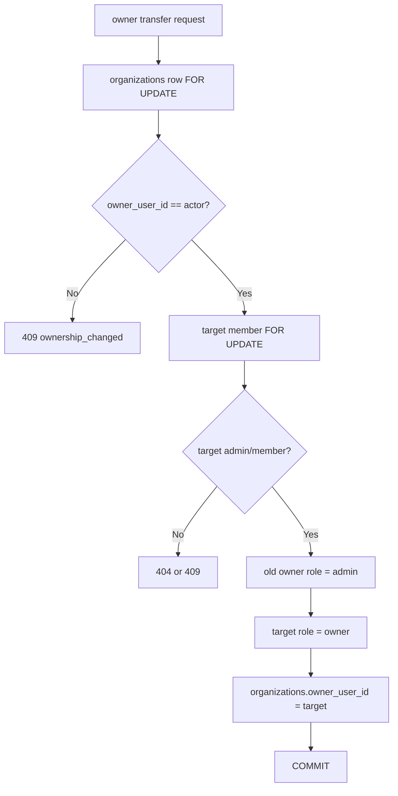

# 組織設定・所有権ライフサイクル

## 目的

組織作成・招待・課金に続き、組織名変更、オーナー移譲、自分自身の退出を安全に行えるようにする。

この機能では、`organizations.owner_user_id` と `organization_members.role = 'owner'` が常に同じユーザーを指すことを重要な不変条件として扱う。

## 対象範囲

- owner/adminによる組織名変更
- ownerによる既存メンバーへのオーナー移譲
- 移譲後の旧ownerをadminへ変更
- admin/memberによる自分自身の退出
- ownerの退出禁止
- 通常メンバー追加APIからowner付与を禁止
- current ownerを通常メンバー削除APIから削除禁止
- owner roleを組織ごとに最大1件へ制限

組織削除、一般的なrole変更、SCIM/SSO、Expoアプリは対象外とする。

## API

| Method | Path | 必要権限 | 用途 |
| --- | --- | --- | --- |
| PATCH | `/v1/orgs/{id}` | owner/admin | 組織名変更 |
| POST | `/v1/orgs/{id}/owner-transfer` | owner | オーナー移譲 |
| POST | `/v1/orgs/{id}/leave` | admin/member | 自分自身の退出 |

既存の`POST /v1/orgs/{id}/members`で指定できるroleは`admin`または`member`のみとする。`owner`はオーナー移譲APIからのみ付与する。

## 権限マトリクス

| 操作 | owner | admin | member |
| --- | --- | --- | --- |
| 組織名変更 | 可 | 可 | 不可 |
| オーナー移譲 | 可 | 不可 | 不可 |
| 他メンバー削除 | 可 | 可 | 不可 |
| current owner削除 | 不可 | 不可 | 不可 |
| 自分自身の退出 | 移譲後のみ | 可 | 可 |
| owner roleの直接付与 | 不可 | 不可 | 不可 |

## 組織名

- 前後空白を除去する
- 空文字は拒否する
- 最大120文字とする
- Unicode rune数で120文字を判定する
- owner/adminのみ変更可能とする

## オーナー移譲

### 前提

- 実行者が現在のownerであること
- 移譲先が同一組織の既存メンバーであること
- 移譲先roleが`admin`または`member`であること
- 自分自身への移譲ではないこと

### トランザクション

`organizations`行を最初にロックするため、同時に複数のowner移譲やowner削除・退出が行われても所有権を直列化できる。

## DB不変条件

migration `000014_organization_owner_invariant`で次を行う。

1. `organizations.owner_user_id`に対応するmembershipをownerとして復元する
2. それ以外の既存owner roleをadminへ正規化する
3. `organization_members (organization_id) WHERE role='owner'`へ部分Unique Indexを作成する

これにより、通常APIや将来の実装ミスがあっても、同一組織へ2件目のowner roleをDBが拒否する。

### down migrationの注意

Unique Indexは削除できるが、up migrationで行った既存roleの正規化は元データを推測できないため巻き戻さない。

## 自分自身の退出

admin/memberは`POST /v1/orgs/{id}/leave`から自身のmembershipを削除できる。

ownerは退出できず、先に別メンバーへownerを移譲する必要がある。

退出時も`organizations`行を`FOR UPDATE`でロックし、同時owner移譲との競合を防ぐ。

### Stripe seat同期

membership削除のDBトランザクションを先に完了し、その後Stripeのseat同期を行う。

Stripe同期だけが失敗した場合、退出済みmembershipを復元しない。APIは`seat_sync_failed_after_leave`を返し、「退出自体は完了したが課金seat同期に失敗した」ことを明示する。

理由は、外部API障害を理由にDB上のアクセス権を復活させると、ユーザーが退出したつもりでも組織アクセスが残るためである。

運用上は、このエラーを検知した場合にStripe seatの再同期・reconciliationを実施する。

## current owner削除防止

既存のメンバー削除APIでも、削除対象を事前取得してowner roleなら拒否する。

さらにStore層でも`organizations`行をロックし、`owner_user_id == target_user_id`なら`ErrConflict`を返す。UIだけに依存せず、Service・Storeの両方で防御する。

## Web

`/organization-settings`へ組織ライフサイクル操作を分離する。

- 組織切替
- 現在の権限表示
- 組織名変更
- owner向け移譲先選択・確認ダイアログ
- admin/member向け退出・確認ダイアログ
- owner向け「移譲後に退出可能」の説明
- `/organizations`と`/invitations`への導線

課金・請求書・通常メンバー管理は既存`/organizations`へ残し、設定責務を混在させない。

## テスト観点

### 正常系

- owner/adminによるrename
- ownerからadmin/memberへのowner transfer
- 移譲後の旧owner=admin、新owner=owner
- admin/memberのself leave

### 異常系

- member rename
- admin/memberによるowner transfer
- self transfer
- 未所属ユーザーへのtransfer
- ownerのself leave
- current ownerの通常削除
- 通常AddMemberでowner role指定

### 境界値

- 空の組織名
- 空白のみの組織名
- 120文字
- 121文字

### 競合・データ整合性

- owner transfer中のowner delete/leave
- 組織ごとのowner roleが最大1件
- `organizations.owner_user_id`とowner membershipが一致すること

### 回帰

- 組織招待
- 課金・seat
- 請求書
- メンバー管理
- ファイル送信・受信・送信履歴

## 次のタスク候補

組織削除は別PRとし、削除前に以下を設計する。

- active/trialing/past_due契約の扱い
- Stripe subscriptionの解約方法
- shipment/fileの保持・削除ポリシー
- S3オブジェクトの削除
- pending invitationの取消
- audit logの保持期間
- 請求書の参照可否
- 誤操作防止の再認証・組織名入力確認
- 削除ジョブの再試行と冪等性
